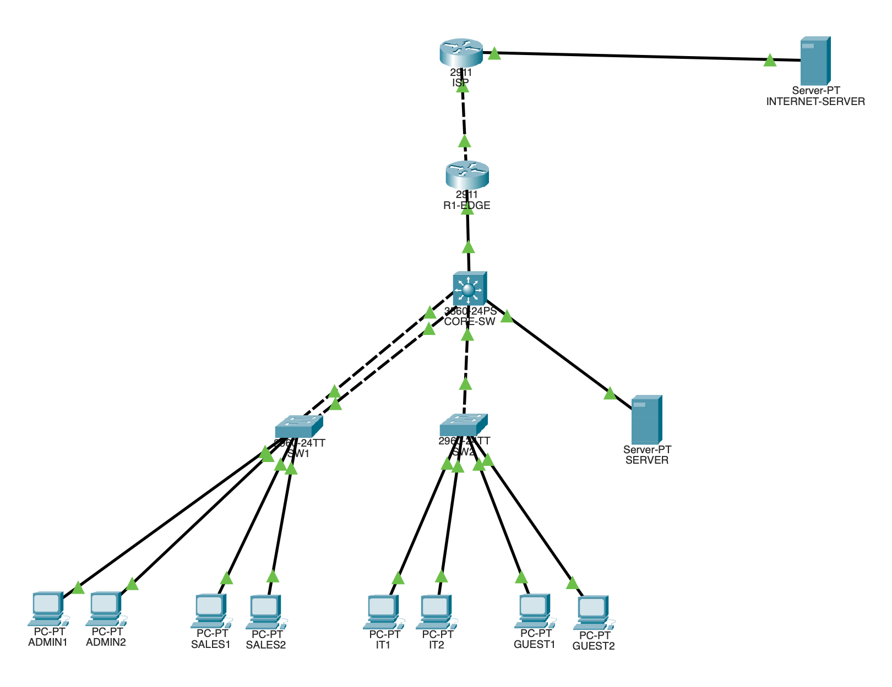

# Enterprise Network Packet Tracer Lab

This project implements a small enterprise network in Cisco Packet Tracer using a multilayer core switch, access switches, an edge router, a simulated ISP, internal services, and multiple departmental VLANs.

The network was built to practice enterprise switching, routing, network services, security controls, Cisco IOS configuration, and systematic troubleshooting.

The lab includes VLAN segmentation, 802.1Q trunking, inter-VLAN routing, DHCP relay, DNS, OSPF, NAT/PAT, ACL-based network isolation, SSH administration, port security, and LACP EtherChannel.

## Network Topology



The topology consists of:

- Cisco 3560 multilayer core switch
- Two Cisco 2960 access switches
- Cisco edge router
- Simulated ISP router
- Internal server
- Simulated Internet server
- ADMIN, SALES, IT, and GUEST workstations

---

## Network Design

### VLAN Addressing

| VLAN | Name | Network | Default Gateway |
|---|---|---|---|
| 10 | ADMIN | `192.168.10.0/24` | `192.168.10.1` |
| 20 | SALES | `192.168.20.0/24` | `192.168.20.1` |
| 30 | IT | `192.168.30.0/24` | `192.168.30.1` |
| 40 | GUEST | `192.168.40.0/24` | `192.168.40.1` |
| 50 | SERVER | `192.168.50.0/24` | `192.168.50.1` |
| 99 | MANAGEMENT | `192.168.99.0/24` | `192.168.99.1` |

### Infrastructure Networks

| Purpose | Network |
|---|---|
| CORE-SW ↔ R1-EDGE | `10.0.0.0/30` |
| R1-EDGE ↔ ISP | `203.0.113.0/30` |
| Simulated Internet Network | `198.51.100.0/24` |

### Infrastructure Addresses

| Device | Interface / Purpose | Address |
|---|---|---|
| CORE-SW | Routed uplink | `10.0.0.2/30` |
| R1-EDGE | Internal uplink | `10.0.0.1/30` |
| R1-EDGE | ISP-facing interface | `203.0.113.2/30` |
| ISP | R1-facing interface | `203.0.113.1/30` |
| ISP | Internet LAN | `198.51.100.1/24` |
| Internal Server | Server VLAN | `192.168.50.10/24` |
| Internet Server | Simulated Internet | `198.51.100.10/24` |
| SW1 | Management | `192.168.99.11/24` |
| SW2 | Management | `192.168.99.12/24` |

---

## Implemented Features

### VLAN Segmentation

Departmental traffic is separated into individual VLANs:

- VLAN 10 — ADMIN
- VLAN 20 — SALES
- VLAN 30 — IT
- VLAN 40 — GUEST
- VLAN 50 — SERVER
- VLAN 99 — MANAGEMENT

Access switch ports are assigned to the appropriate departmental VLAN, while switch uplinks carry multiple VLANs using 802.1Q trunks.

### Inter-VLAN Routing

`CORE-SW` operates as a Layer 3 switch.

Switched Virtual Interfaces (SVIs) provide the default gateway for each VLAN, and `ip routing` enables communication between permitted networks.

Example:

```text
interface Vlan10
 ip address 192.168.10.1 255.255.255.0
```

---

## DHCP and DHCP Relay

A centralized DHCP service runs on the internal server:

```text
192.168.50.10
```

DHCP pools dynamically provide addressing for:

- ADMIN
- SALES
- IT
- GUEST

Because the DHCP server resides in a separate VLAN, the core switch uses DHCP relay:

```text
ip helper-address 192.168.50.10
```

on the client VLAN SVIs.

Infrastructure and management addresses remain statically assigned.

---

## DNS and Internal Services

The internal server also provides DNS and HTTP services.

Internal DNS includes:

```text
intranet.corp.local → 192.168.50.10
```

Enterprise clients can resolve the hostname and access the internal web service.

---

## Dynamic Routing

OSPF is configured between `CORE-SW` and `R1-EDGE`.

The core advertises the enterprise VLAN networks to the edge router.

Example networks include:

```text
192.168.10.0/24
192.168.20.0/24
192.168.30.0/24
192.168.40.0/24
192.168.50.0/24
192.168.99.0/24
```

The OSPF adjacency operates across:

```text
10.0.0.0/30
```

`R1-EDGE` uses a static default route toward the simulated ISP:

```text
ip route 0.0.0.0 0.0.0.0 203.0.113.1
```

and advertises the default route into OSPF.

---

## NAT/PAT

Private enterprise networks access the simulated Internet through PAT on `R1-EDGE`.

The outside address is:

```text
203.0.113.2
```

The NAT overload configuration allows multiple internal clients to share the same outside IPv4 address:

```text
ip nat inside source list 1 interface GigabitEthernet0/0 overload
```

The simulated Internet server is located at:

```text
198.51.100.10
```

---

## Guest Network Isolation

An extended ACL named `GUEST-IN` restricts the Guest VLAN.

The policy allows Guest clients to:

- Obtain DHCP configuration
- Use the internal DNS server
- Access the simulated Internet

Guest clients are prevented from accessing:

- ADMIN
- SALES
- IT
- SERVER
- MANAGEMENT

The intended policy is:

```text
Guest → DHCP          ALLOW
Guest → DNS           ALLOW
Guest → Internal      DENY
Guest → Internet      ALLOW
```

---

## Management VLAN and SSH

Network infrastructure is remotely administered through VLAN 99.

Management addresses include:

```text
CORE-SW    192.168.99.1
SW1        192.168.99.11
SW2        192.168.99.12
```

SSH version 2 is configured for encrypted remote administration.

Administrative access is restricted to the IT subnet:

```text
192.168.30.0/24
```

using an ACL applied to the VTY lines.

This allows IT workstations to remotely manage network devices while preventing administration from other user VLANs.

---

## Switch Port Security

Port security is enabled on user-facing access ports.

Configuration includes:

- Maximum of one MAC address per port
- Sticky MAC learning
- Restrict violation mode

Example:

```text
switchport port-security
switchport port-security maximum 1
switchport port-security mac-address sticky
switchport port-security violation restrict
```

This limits each access port to its learned endpoint MAC address.

---

## LACP EtherChannel

Two physical links between `CORE-SW` and `SW1` are bundled using LACP.

The resulting logical interface is:

```text
Port-channel1
```

The EtherChannel provides:

- Link redundancy
- Aggregate bandwidth
- A single logical interface for Spanning Tree
- Trunk transport for multiple VLANs

Successful operation was verified using:

```text
show etherchannel summary
```

with both member interfaces bundled into `Po1`.

---

# Troubleshooting Simulations

In addition to building the working network, several faults were intentionally introduced and diagnosed.

Each troubleshooting case documents:

1. Symptoms
2. Diagnostic process
3. Root cause
4. Corrective action
5. Verification

## VLAN Misconfiguration

An ADMIN workstation lost connectivity after its switch access port was incorrectly assigned to the SALES VLAN.

Troubleshooting included:

```text
ipconfig
ping
show interfaces status
show vlan brief
```

The incorrect VLAN assignment was identified and corrected.

[View VLAN Misconfiguration Troubleshooting](troubleshooting-simulations/vlan-misconfiguration/vlan-misconfiguration.md)

---

## DHCP Relay Failure

The DHCP relay configuration was removed from the SALES SVI.

The client failed to obtain a DHCP lease and assigned itself an APIPA address.

The failure was isolated by comparing the affected SVI against a working VLAN and identifying the missing:

```text
ip helper-address 192.168.50.10
```

[View DHCP Relay Failure Troubleshooting](troubleshooting-simulations/dhcp-relay-failure/dhcp-relay-failure.md)

---

## Guest ACL Misconfiguration

The final Internet permit statement was removed from the Guest ACL.

Guest clients retained valid network configuration but lost Internet access, while other VLANs remained unaffected.

Inspection of `GUEST-IN` revealed that Guest traffic was reaching the ACL's implicit deny.

The missing permit statement was restored while maintaining Guest isolation from internal networks.

[View Guest ACL Misconfiguration Troubleshooting](troubleshooting-simulations/guest-acl-misconfiguration/guest-acl-misconfiguration.md)

---

## NAT/PAT Failure

The NAT overload rule was removed from `R1-EDGE`.

Internal clients could continue communicating with internal resources but could no longer reach the simulated Internet.

`R1-EDGE` itself retained Internet connectivity, narrowing the problem to translation of forwarded private traffic.

Restoring:

```text
ip nat inside source list 1 interface GigabitEthernet0/0 overload
```

restored Internet connectivity.

The fix was verified through both client connectivity and the NAT translation table.

[View NAT/PAT Failure Troubleshooting](troubleshooting-simulations/nat-pat-failure/nat-pat-failure.md)

---

# Troubleshooting Commands Used

The project involved regular use of Cisco IOS diagnostic commands including:

```text
show ip interface brief
show interfaces status
show interfaces trunk
show vlan brief
show ip route
show ip ospf neighbor
show access-lists
show ip nat translations
show ip nat statistics
show etherchannel summary
show port-security
show running-config
ping
```

These commands were used to isolate failures across Layers 2 and 3 rather than relying solely on configuration inspection.

---

# Skills Demonstrated

This project demonstrates practical experience with:

- Cisco IOS CLI
- IPv4 addressing and subnetting
- VLAN configuration
- Access and trunk ports
- IEEE 802.1Q
- Layer 3 switching
- Inter-VLAN routing
- DHCP
- DHCP relay
- DNS
- Static and default routing
- OSPF
- NAT
- PAT / NAT overload
- Standard and extended ACLs
- Network segmentation
- Guest network isolation
- SSH administration
- Management VLANs
- VTY access restrictions
- Switch port security
- Sticky MAC addresses
- LACP
- EtherChannel
- Layer 2 troubleshooting
- Layer 3 troubleshooting
- Cisco network verification commands

---

# Packet Tracer File

The completed working topology is available here:

[Download the Packet Tracer topology](enterprise-network.pkt)

The `.pkt` file contains the final known-good configuration of the enterprise network.

---

# Repository Structure

```text
enterprise-network-packet-tracer/
│
├── README.md
├── enterprise-network.pkt
│
├── screenshots/
│   └── topology.png
│
├── configs/
│   ├── core-sw.txt
│   ├── sw1.txt
│   ├── sw2.txt
│   ├── r1-edge.txt
│   └── isp.txt
│
└── troubleshooting-simulations/
    ├── vlan-misconfiguration/
    │   ├── vlan-misconfiguration.md
    │   └── screenshots/
    │
    ├── dhcp-relay-failure/
    │   ├── dhcp-relay-failure.md
    │   └── screenshots/
    │
    ├── guest-acl-misconfiguration/
    │   ├── guest-acl-misconfiguration.md
    │   └── screenshots/
    │
    └── nat-pat-failure/
        ├── nat-pat-failure.md
        └── screenshots/
```

---

## Project Purpose

This lab was built to develop hands-on networking skills beyond conceptual study by configuring, validating, intentionally breaking, diagnosing, and repairing a simulated enterprise environment.

The project focuses on networking concepts and troubleshooting techniques applicable to Cisco CCNA-level networking, IT support, network administration, and cybersecurity.
