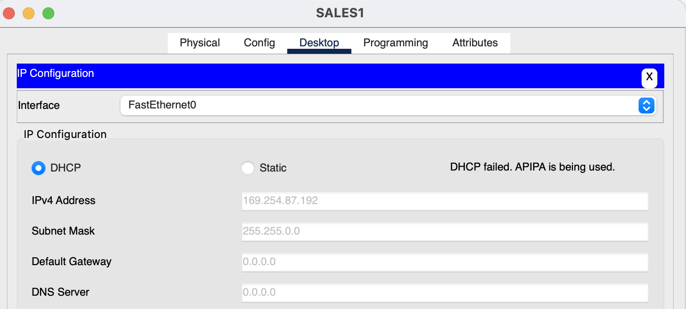
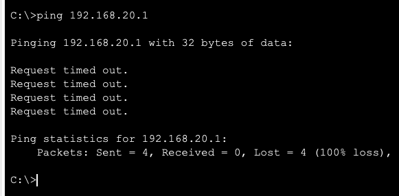
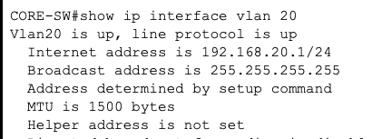
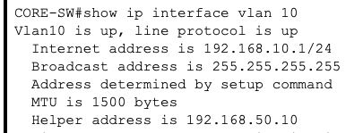
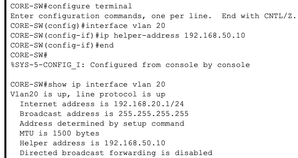
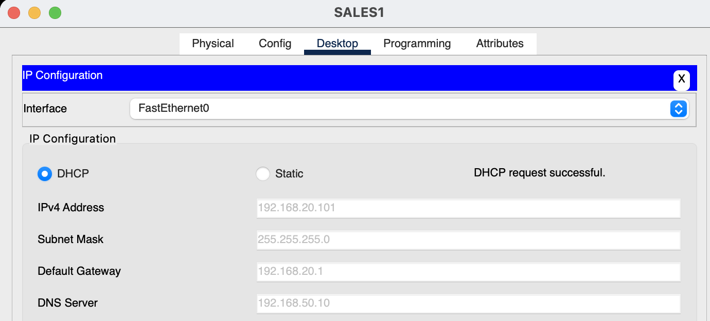
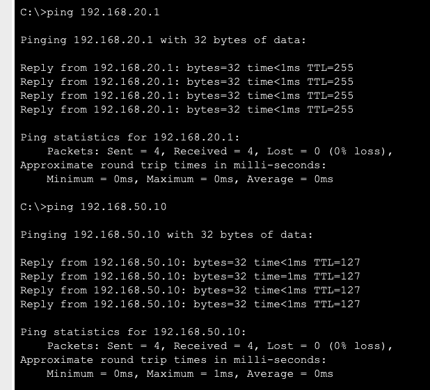

# DHCP Relay Failure Troubleshooting

## Scenario

The enterprise network uses a centralized DHCP server located in the Server VLAN:

```text
DHCP Server: 192.168.50.10
VLAN:        50
```

Client devices in other VLANs rely on DHCP relay configured on the Layer 3 interfaces of `CORE-SW`.

For the SALES network:

```text
VLAN:            20
Network:         192.168.20.0/24
Default Gateway: 192.168.20.1
DHCP Server:     192.168.50.10
```

To simulate a DHCP relay failure, the helper address was intentionally removed from the VLAN 20 SVI:

```text
configure terminal
interface vlan 20
 no ip helper-address 192.168.50.10
end
```

---

## Expected DHCP Operation

The DHCP server is located in a different subnet from SALES clients.

A DHCP client initially sends a broadcast DHCP Discover message. Routers normally do not forward Layer 3 broadcasts between networks.

The `ip helper-address` configuration on `CORE-SW` allows DHCP traffic from VLAN 20 to be relayed to the centralized DHCP server:

```text
SALES1
192.168.20.0/24
      |
      | DHCP broadcast
      v
CORE-SW
VLAN20 SVI
192.168.20.1
      |
      | DHCP relay
      v
192.168.50.10
DHCP Server
```

Without the helper address, DHCP requests from VLAN 20 cannot reach the server.

---

## Symptoms

After the DHCP relay configuration was removed, `SALES1` was forced to request a new DHCP lease.

The request failed and Packet Tracer reported:

```text
DHCP failed. APIPA is being used.
```

The workstation automatically assigned itself:

```text
IPv4 Address:    169.254.87.192
Subnet Mask:     255.255.0.0
Default Gateway: 0.0.0.0
DNS Server:      0.0.0.0
```



An address in the `169.254.0.0/16` range is an APIPA address and indicates that the client was unable to obtain a lease from a DHCP server.

Because no valid default gateway was received, `SALES1` could not reach the VLAN 20 gateway:

```text
ping 192.168.20.1
```

The result was 100% packet loss.



---

## Troubleshooting Process

### 1. Identify the Client Addressing Failure

The DHCP failure resulted in an APIPA address rather than an address from the expected SALES DHCP pool:

```text
Expected: 192.168.20.x
Received: 169.254.87.192
```

This strongly indicated a DHCP communication problem rather than a general routing issue.

### 2. Determine Whether DHCP Was Failing Network-Wide

Other VLANs continued to receive valid DHCP leases.

Because DHCP remained operational elsewhere, the centralized DHCP server itself was unlikely to be the cause.

The investigation therefore focused on configuration specific to VLAN 20.

### 3. Inspect the VLAN 20 Layer 3 Interface

On `CORE-SW`:

```text
show ip interface vlan 20
```

The output showed:

```text
Vlan20 is up, line protocol is up
Internet address is 192.168.20.1/24
Helper address is not set
```



The SVI itself was operational, but no DHCP relay destination was configured.

### 4. Compare Against a Working VLAN

VLAN 10 was inspected for comparison:

```text
show ip interface vlan 10
```

Its configuration showed:

```text
Vlan10 is up, line protocol is up
Internet address is 192.168.10.1/24
Helper address is 192.168.50.10
```



The difference between the working VLAN and the failed VLAN identified the missing DHCP relay configuration.

---

## Root Cause

The VLAN 20 SVI was missing:

```text
ip helper-address 192.168.50.10
```

The DHCP server resides in VLAN 50 while `SALES1` resides in VLAN 20.

Because DHCP Discover traffic begins as a broadcast and Layer 3 devices do not normally forward broadcasts between subnets, the request could not reach the DHCP server without DHCP relay.

As a result, the client failed to receive:

- An IPv4 address
- A subnet mask
- A default gateway
- A DNS server address

and instead assigned itself an APIPA address.

---

## Resolution

The DHCP relay configuration was restored on the VLAN 20 SVI:

```text
configure terminal
interface vlan 20
 ip helper-address 192.168.50.10
end
```

The configuration was then verified:

```text
show ip interface vlan 20
```

The output showed:

```text
Helper address is 192.168.50.10
```



---

## Verification

`SALES1` was instructed to request another DHCP lease.

The request completed successfully and the workstation received:

```text
IPv4 Address:    192.168.20.101
Subnet Mask:     255.255.255.0
Default Gateway: 192.168.20.1
DNS Server:      192.168.50.10
```



The returned address belongs to the correct SALES network:

```text
192.168.20.0/24
```

The presence of the correct default gateway and DNS server confirmed that the DHCP server was once again successfully servicing VLAN 20 through the relay.


Additional connectivity tests confirmed that SALES1 could again reach both its default gateway and the internal server.



---

## Commands Used

### CORE-SW

Inspect VLAN 20:

```text
show ip interface vlan 20
```

Compare against a working VLAN:

```text
show ip interface vlan 10
```

Restore DHCP relay:

```text
configure terminal
interface vlan 20
 ip helper-address 192.168.50.10
end
```

Verify:

```text
show ip interface vlan 20
```

### SALES1

Connectivity test:

```text
ping 192.168.20.1
```

DHCP was renewed through Packet Tracer's:

```text
Desktop → IP Configuration → DHCP
```

---

## Troubleshooting Summary

| Stage | Finding |
|---|---|
| DHCP request | Failed |
| Client address | APIPA `169.254.87.192` |
| Default gateway | Not assigned |
| VLAN 20 SVI | Up/up |
| DHCP server | Operational for other VLANs |
| VLAN 20 helper address | Missing |
| Working VLAN comparison | Helper set to `192.168.50.10` |
| Root cause | Missing DHCP relay configuration |
| Corrective action | Restored `ip helper-address 192.168.50.10` |
| Final DHCP address | `192.168.20.101/24` |
| Final result | DHCP service restored |

---

## Key Takeaway

When clients in one VLAN cannot obtain DHCP leases while clients in other VLANs can, the failure may be specific to DHCP relay rather than the DHCP server itself.

The APIPA address provided an immediate indication that DHCP had failed. Comparing the affected SVI with a working SVI then exposed the missing `ip helper-address`.

This troubleshooting process isolated the failure by checking:

1. Client addressing behavior.
2. Scope of the DHCP outage.
3. SVI operational status.
4. DHCP relay configuration.
5. A known-good VLAN for comparison.
6. Client operation after restoring the configuration.
