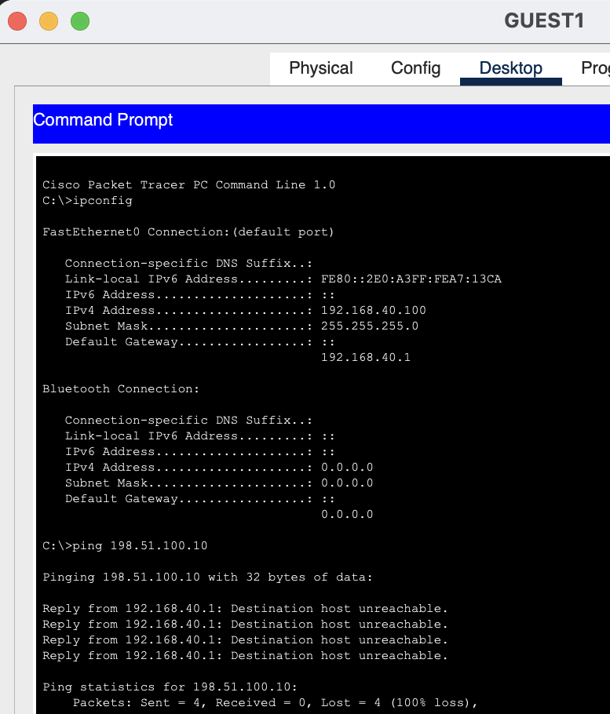
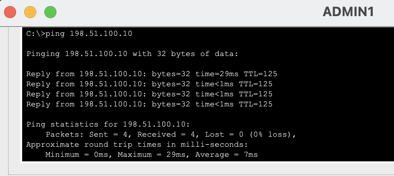
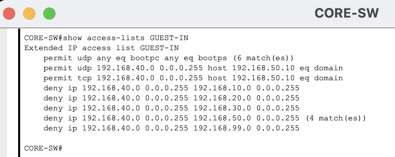
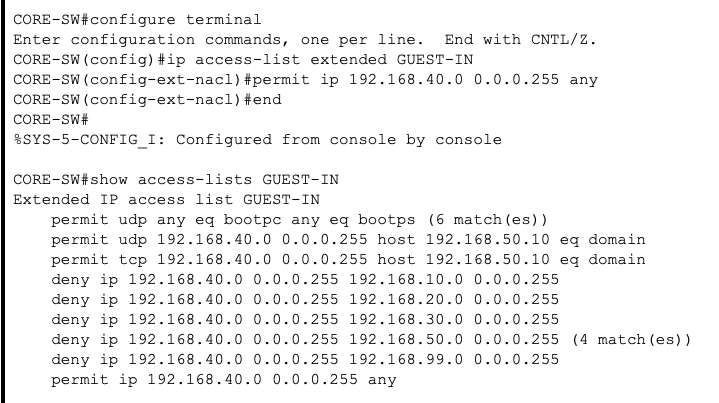
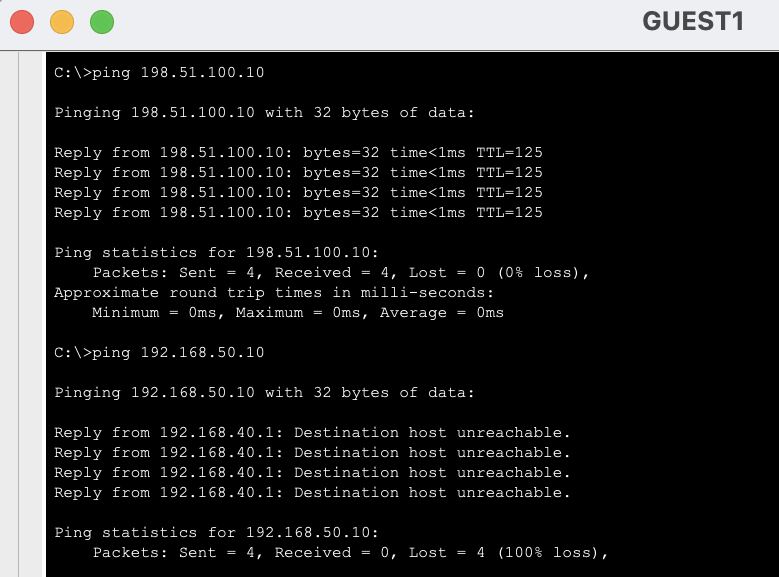

# Guest ACL Misconfiguration Troubleshooting

## Scenario

The Guest VLAN is designed to allow Internet access while preventing access to internal enterprise networks.

The Guest network uses:

```text
VLAN:            40
Network:         192.168.40.0/24
Default Gateway: 192.168.40.1
```

An extended ACL named `GUEST-IN` is applied inbound to the VLAN 40 SVI on `CORE-SW`.

The intended policy is:

```text
Guest → DHCP                ALLOW
Guest → DNS                 ALLOW
Guest → ADMIN               DENY
Guest → SALES               DENY
Guest → IT                  DENY
Guest → SERVER              DENY
Guest → MANAGEMENT          DENY
Guest → Internet            ALLOW
```

To simulate an ACL configuration error, the final permit statement was intentionally removed:

```text
configure terminal
ip access-list extended GUEST-IN
 no permit ip 192.168.40.0 0.0.0.255 any
end
```

---

## Symptoms

`GUEST1` retained a valid DHCP address:

```text
IPv4 Address:    192.168.40.100
Subnet Mask:     255.255.255.0
Default Gateway: 192.168.40.1
```

However, it could no longer reach the simulated Internet server:

```text
ping 198.51.100.10
```

The ping failed with 100% packet loss.



Because the workstation still had a valid IP address and default gateway, the problem did not initially appear to be DHCP-related.

---

## Troubleshooting Process

### 1. Verify That the Internet Was Still Reachable From Other VLANs

To determine whether the failure affected the entire enterprise network, `ADMIN1` was used to test connectivity to the same Internet server:

```text
ping 198.51.100.10
```

The test succeeded with 0% packet loss.



This confirmed that:

- The ISP connection was operational.
- The Internet server was reachable.
- Routing toward the Internet was functioning.
- NAT/PAT on `R1-EDGE` was functioning.

The failure therefore appeared to be specific to the Guest VLAN.

---

### 2. Inspect the Guest ACL

The ACL applied to Guest traffic was inspected on `CORE-SW`:

```text
show access-lists GUEST-IN
```

The output contained the expected DHCP and DNS permits and the internal-network deny statements:

```text
permit udp any eq bootpc any eq bootps

permit udp 192.168.40.0 0.0.0.255 host 192.168.50.10 eq domain
permit tcp 192.168.40.0 0.0.0.255 host 192.168.50.10 eq domain

deny ip 192.168.40.0 0.0.0.255 192.168.10.0 0.0.0.255
deny ip 192.168.40.0 0.0.0.255 192.168.20.0 0.0.0.255
deny ip 192.168.40.0 0.0.0.255 192.168.30.0 0.0.0.255
deny ip 192.168.40.0 0.0.0.255 192.168.50.0 0.0.0.255
deny ip 192.168.40.0 0.0.0.255 192.168.99.0 0.0.0.255
```

However, the final permit rule was missing:

```text
permit ip 192.168.40.0 0.0.0.255 any
```



---

## Root Cause

Cisco ACLs are evaluated from top to bottom.

The first matching rule is applied, and any traffic that does not match an explicit permit statement reaches the implicit rule at the end of every ACL:

```text
deny ip any any
```

The intended ACL behavior was:

```text
Allow DHCP
Allow DNS
Deny access to internal VLANs
Allow all remaining Guest traffic
```

After the final permit rule was removed, the effective behavior became:

```text
Allow DHCP
Allow DNS
Deny access to internal VLANs
Implicitly deny everything else
```

Internet-bound Guest traffic did not match any earlier permit rule and was therefore dropped by the implicit deny.

---

## Resolution

The missing permit statement was restored:

```text
configure terminal
ip access-list extended GUEST-IN
 permit ip 192.168.40.0 0.0.0.255 any
end
```

The corrected ACL was verified with:

```text
show access-lists GUEST-IN
```

The final entry now appeared:

```text
permit ip 192.168.40.0 0.0.0.255 any
```



---

## Verification

Two tests were performed from `GUEST1`.

### Internet Access

```text
ping 198.51.100.10
```

The Internet server responded successfully.

### Internal Server Access

```text
ping 192.168.50.10
```

The internal server remained unreachable, as intended by the Guest security policy.



This confirmed that the ACL was working as designed:

```text
Guest → Internet          ALLOWED
Guest → Internal Server   DENIED
```

The correction restored Internet connectivity without weakening the Guest VLAN's isolation from internal enterprise resources.

---

## Commands Used

### GUEST1

```text
ipconfig
ping 198.51.100.10
ping 192.168.50.10
```

### ADMIN1

```text
ping 198.51.100.10
```

### CORE-SW

Inspect the ACL:

```text
show access-lists GUEST-IN
```

Restore the missing permit:

```text
configure terminal
ip access-list extended GUEST-IN
 permit ip 192.168.40.0 0.0.0.255 any
end
```

Verify the correction:

```text
show access-lists GUEST-IN
```

---

## Troubleshooting Summary

| Stage | Finding |
|---|---|
| Guest IP configuration | Valid |
| Guest default gateway | Valid |
| Guest Internet access | Failed |
| ADMIN Internet access | Working |
| ISP connectivity | Working |
| NAT/PAT | Working |
| Guest ACL | Missing final Internet permit |
| Root cause | Traffic reached implicit ACL deny |
| Corrective action | Restored final permit rule |
| Guest Internet access after fix | Working |
| Guest internal-server access after fix | Still blocked |
| Final result | Intended security policy restored |

---

## Key Takeaway

A valid IP address and functioning upstream Internet connection do not rule out an access-control problem.

Because `ADMIN1` could reach the Internet while `GUEST1` could not, the failure could be narrowed to Guest-specific configuration.

Inspecting `GUEST-IN` revealed that the final permit statement had been removed. Since Cisco ACLs contain an implicit `deny ip any any` at the end, all Guest traffic not explicitly allowed was dropped.

The troubleshooting process demonstrated the importance of:

1. Determining whether the failure is network-wide or VLAN-specific.
2. Verifying known-good connectivity from another network.
3. Inspecting ACL order and contents.
4. Remembering the implicit deny rule.
5. Confirming both permitted and denied traffic after making a correction.
