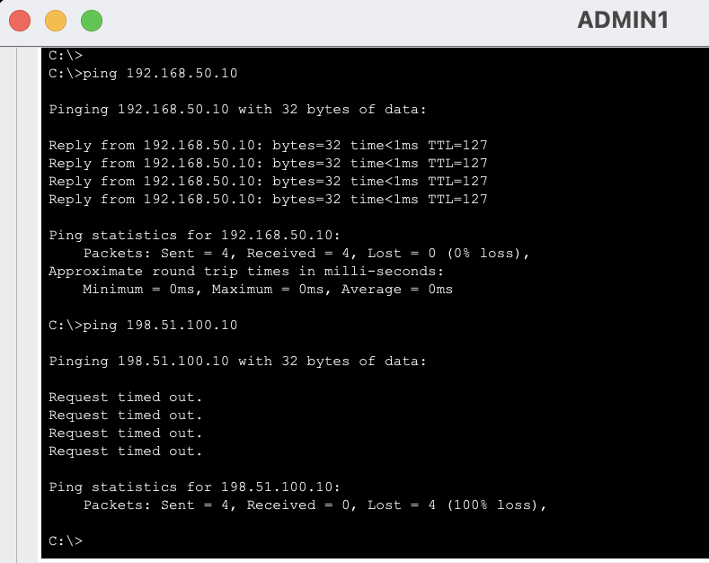
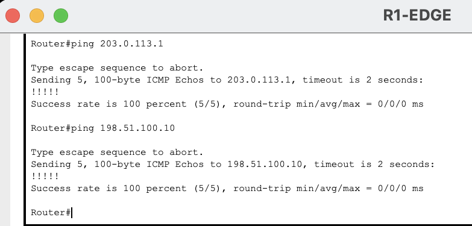
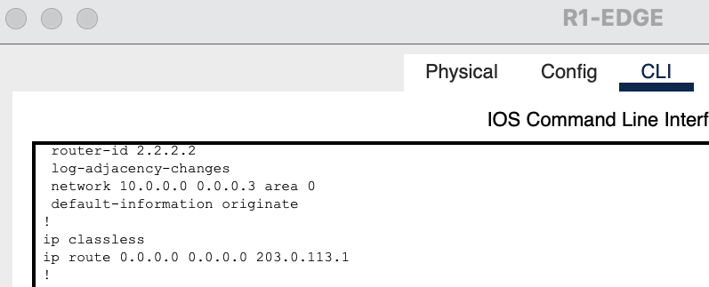
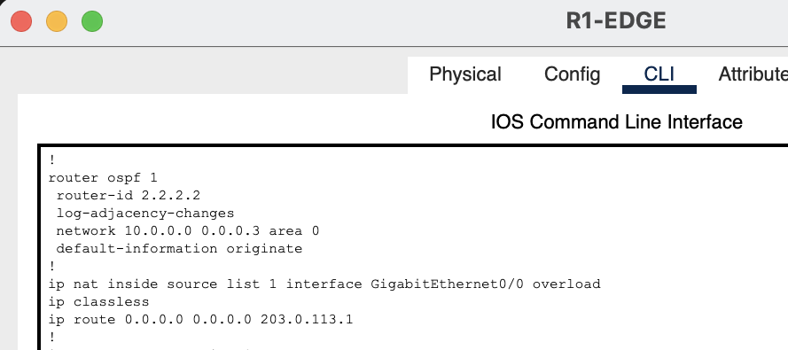
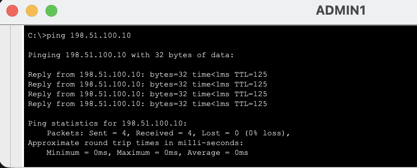
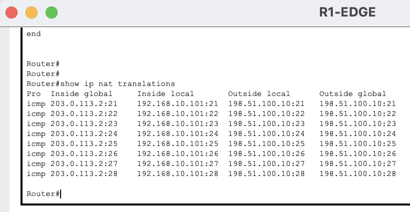

# NAT/PAT Failure Troubleshooting

## Scenario

The enterprise network uses `R1-EDGE` to provide Internet access for internal private networks.

Internal devices use RFC1918 addresses such as:

```text
192.168.10.0/24
192.168.20.0/24
192.168.30.0/24
192.168.40.0/24
192.168.50.0/24
```

`R1-EDGE` translates these private addresses to its outside interface address:

```text
203.0.113.2
```

using PAT (NAT overload).

The normal configuration includes:

```text
ip nat inside source list 1 interface GigabitEthernet0/0 overload
```

To simulate a NAT/PAT failure, this command was intentionally removed:

```text
configure terminal
no ip nat inside source list 1 interface gi0/0 overload
end
```

The inside and outside NAT interface designations were left unchanged so that the failure was isolated specifically to the missing PAT rule.

---

## Expected NAT/PAT Operation

The enterprise clients use private IPv4 addresses that are not routed across the simulated ISP network.

For example:

```text
ADMIN1
192.168.10.101
      |
      v
R1-EDGE
203.0.113.2
      |
      v
ISP
      |
      v
INTERNET-SERVER
198.51.100.10
```

PAT translates the source address:

```text
192.168.10.101
```

to:

```text
203.0.113.2
```

before the traffic leaves `R1-EDGE`.

The return traffic is then translated back to the original internal client.

---

## Symptoms

`ADMIN1` could still reach the internal server:

```text
ping 192.168.50.10
```

The test succeeded with 0% packet loss.

However, the same workstation could not reach the simulated Internet server:

```text
ping 198.51.100.10
```

The test failed with 100% packet loss.



This indicated that:

- VLAN connectivity was working.
- Inter-VLAN routing was working.
- Internal routing remained operational.
- The failure affected external connectivity rather than the internal enterprise network.

---

## Troubleshooting Process

### 1. Verify Internet Connectivity From R1-EDGE

The next step was to determine whether the ISP connection itself was operational.

From `R1-EDGE`:

```text
ping 203.0.113.1
ping 198.51.100.10
```

Both tests succeeded with 100% success.



This confirmed that:

- The R1-to-ISP link was operational.
- The ISP router was reachable.
- The Internet server was reachable.
- The problem affected forwarded client traffic rather than traffic originating from `R1-EDGE`.

This narrowed the problem toward NAT/PAT.

---

### 2. Inspect the R1-EDGE Configuration

The running configuration was inspected.

The default route was still present:

```text
ip route 0.0.0.0 0.0.0.0 203.0.113.1
```

OSPF configuration was also still present and advertising the default route toward the enterprise network.

However, the PAT statement was missing.

The configuration lacked:

```text
ip nat inside source list 1 interface GigabitEthernet0/0 overload
```



This explained why `R1-EDGE` itself could reach the Internet while private internal clients could not.

---

## Root Cause

The NAT overload rule had been removed from `R1-EDGE`.

Without:

```text
ip nat inside source list 1 interface GigabitEthernet0/0 overload
```

traffic from private enterprise addresses was forwarded toward the ISP without being translated.

For example, traffic from `ADMIN1` retained the source address:

```text
192.168.10.101
```

instead of being translated to:

```text
203.0.113.2
```

The simulated ISP did not have a route back to the private `192.168.10.0/24` network.

As a result, return traffic could not reach the originating client.

---

## Resolution

The missing PAT rule was restored on `R1-EDGE`:

```text
configure terminal
ip nat inside source list 1 interface gi0/0 overload
end
```

The running configuration was then inspected again.

The NAT overload command was present:

```text
ip nat inside source list 1 interface GigabitEthernet0/0 overload
```



---

## Verification

### 1. Verify Client Internet Connectivity

From `ADMIN1`:

```text
ping 198.51.100.10
```

The Internet server responded successfully with 0% packet loss.



### 2. Verify NAT Translations

After generating traffic from `ADMIN1`, the NAT translation table was inspected on `R1-EDGE`:

```text
show ip nat translations
```

The table showed mappings between the internal private address and the public-facing R1 address.

For example:

```text
Inside local:   192.168.10.101
Inside global:  203.0.113.2
Outside global: 198.51.100.10
```



The presence of active translations confirmed that PAT was operating correctly again.

---

## Commands Used

### ADMIN1

```text
ping 192.168.50.10
ping 198.51.100.10
```

### R1-EDGE

Verify upstream connectivity:

```text
ping 203.0.113.1
ping 198.51.100.10
```

Inspect NAT:

```text
show ip nat translations
show ip nat statistics
```

Inspect configuration:

```text
show running-config
```

Restore PAT:

```text
configure terminal
ip nat inside source list 1 interface gi0/0 overload
end
```

Verify translations:

```text
show ip nat translations
```

---

## Troubleshooting Summary

| Stage | Finding |
|---|---|
| Internal server connectivity | Working |
| ADMIN1 Internet connectivity | Failed |
| R1-EDGE → ISP | Working |
| R1-EDGE → Internet server | Working |
| Default route | Present |
| Internal routing | Working |
| PAT rule | Missing |
| Root cause | NAT overload configuration removed |
| Corrective action | Restored PAT rule |
| ADMIN1 Internet connectivity after fix | Working |
| NAT translation table after fix | Active translations present |

---

## Key Takeaway

Successful Internet connectivity from the edge router does not guarantee that internal clients can reach external networks.

In this scenario:

```text
R1-EDGE → Internet    WORKING
ADMIN1 → Internet     FAILING
ADMIN1 → Internal     WORKING
```

This strongly suggested that the problem was related to traffic being forwarded from the private network rather than general routing or ISP connectivity.

The missing PAT rule prevented private source addresses from being translated before reaching the ISP.

The troubleshooting process demonstrated the value of:

1. Comparing internal and external connectivity.
2. Testing from the edge router itself.
3. Separating routing problems from address-translation problems.
4. Inspecting the NAT configuration.
5. Verifying the fix with both client connectivity and the NAT translation table.
